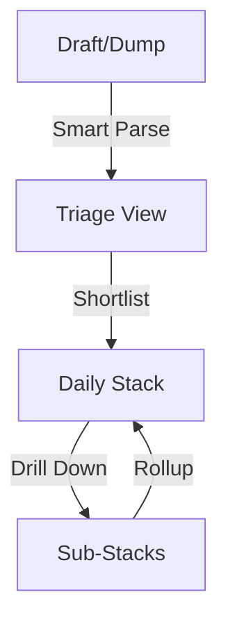

# Architecture Overview

This document describes the high-level conceptual model and interaction patterns of the Todo Flow plugin.

## 1. The Data Funnel
The plugin is designed as a funnel that moves tasks from raw ideas to a structured daily schedule.

- **Draft/Dump**: Rapid text entry. Tasks are appended to files with `flow_state: dump`.
- **Triage View**: A temporary staging area where the user decides what to tackle today.
- **Daily Stack**: The primary workbench where tasks are ordered and timed.

## 2. The Projection Principle (Disk as Source of Truth)
Unlike many plugins that maintain state in memory, Todo Flow treats the filesystem as the single source of truth.

- **Reactive Projections**: The UI (Svelte components) is a reactive projection of the Markdown files.
- **Immediate Persistence**: Any UI interaction (reordering, duration change) triggers an immediate disk write.
- **External Sync**: The `NavigationManager` monitors for external file changes (e.g., from Obsidian Sync) and triggers a UI refresh to maintain consistency.

## 3. Interaction Sovereignty
With multiple views and complex gestures, the plugin must meticulously manage "who is listening."

- **Handshake Pattern**: Views do not compete for keys. A central service tracks the "Sovereign View," and views only act if they have the handshake.
- **Gesture Shadowing**: High-level gestures (swipes) are "shadowed" by internal elements (buttons) using strict event propagation stoppage.
- **Selection Synchronization (Invariant)**: All non-navigational commands (Anchor, Complete, Archive) MUST keep the UI projection (selection) in sync with the model's new position. The UI layer must never result in a stale focus after a command execution.
- **Static Pattern**: High-frequency mobile buttons use static visual states to ensure hardware-level stability (Android), relying on the Reactive Projection for feedback.
- **Navigation Integration**: To respect the host environment and enable native back/forward buttons, views must set `this.navigation = true`. This ensures Obsidian's history stack captures internal plugin navigation (e.g., drill-downs).
- **Editing Sovereignty (The Buffer)**: The "Handshake" ensures keyboard dominance, but physical visibility requires space. Views must inject a dynamic "Editing Buffer" (bottom padding) while an input is active to ensure the task remains centerable during viewport shifts.

## 4. Design Philosophy: Home Row First
The system is built for users who want to stay on the keyboard.
- Every action has a hotkey.
- Focus is managed automatically after setiap command to ensure the keyboard is never "lost."
- Mouse/Touch gestures are provided for parity, but never as a requirement.

## 5. Workflow Integrity (Data Safety)
To prevent data loss during view transitions (specifically Triage -> Stack), the system follows a strict **Read-Merge-Write** protocol.
- **Never Overwrite**: A view (or command) must never blindly overwrite a target file (like `CurrentStack.md`) if it already exists.
- **Decision Phase**: If a write conflict is detected (e.g., Triage complete but Stack exists), the system MUST enter a Decision Phase, presenting the user with clear options (Merge vs. Overwrite) via a Conflict Card or Modal.
- **Merge Strategy**: The system must load the existing content, append/merge the new items (deduplicating by ID), and then write the result.

## 6. The Shared State Pattern (Unified Truth)
To prevent state drift between the Logic Layer (`NavigationManager`) and the UI Layer (`Svelte`), the system employs a Unidirectional Data Flow.

- **Single Source of Truth**: `NavigationManager` holds the canonical `currentStack` and `focusedIndex`.
- **Reactive Bridge**: `StackUIState` acts as the reactive glue, converting imperative class state into Svelte 5 runes (`$state`).
- **The Funnel**: `StackView.svelte` uses an `$effect` to ingest the `navState` derived from the manager. It NEVER modifies local state directly for navigation or data; it calls methods on the Controller/Manager, which update the Truth, which then flows back down to the UI.

## 7. Performance vs. Durability (The Graphite Fix)
- **Non-Destructive Graph Building**: The `GraphBuilder` MUST never prune sub-tasks based on the parent's current status (e.g., DONE). This ensures that structural data (sub-task durations) remains durable if a task is toggled back to TODO.
- **Asynchronous View Transitions**: All major view transitions (Dump -> Triage -> Stack) must be awaited. This prevents UI race conditions where one view closes before the next has fully computed its projection from the disk.
