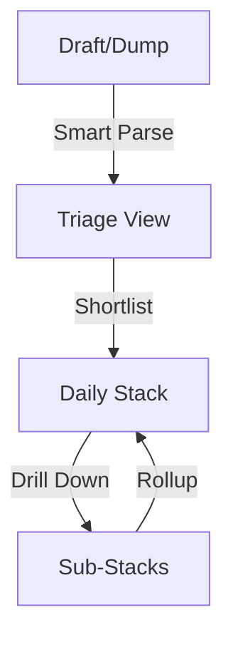

# Architecture Overview

This document describes the high-level conceptual model and interaction patterns of the Todo Flow plugin.

## 1. The Data Funnel
The plugin is designed as a funnel that moves tasks from raw ideas to a structured daily schedule.

- **Draft/Dump**: Rapid text entry. Tasks are appended to files with `flow_state: dump`.
- **Triage View**: A temporary staging area where the user decides what to tackle today.
- **Daily Stack**: The primary workbench where tasks are ordered and timed.

## 2. The Projection Principle (Disk as Source of Truth)
Unlike many plugins that maintain state in memory, Todo Flow treats the filesystem as the single source of truth.

- **Reactive Projections**: The UI (Svelte components) is a reactive projection of the Markdown files.
- **Immediate Persistence**: Any UI interaction (reordering, duration change) triggers an immediate disk write.
- **External Sync**: The `NavigationManager` monitors for external file changes (e.g., from Obsidian Sync) and triggers a UI refresh to maintain consistency.

## 3. Interaction Sovereignty
With multiple views and complex gestures, the plugin must meticulously manage "who is listening."

- **Handshake Pattern**: Views do not compete for keys. A central service tracks the "Sovereign View," and views only act if they have the handshake.
- **Gesture Shadowing**: High-level gestures (swipes) are "shadowed" by internal elements (buttons) using strict event propagation stoppage.
- **Static Pattern**: High-frequency mobile buttons use static visual states to ensure hardware-level stability (Android), relying on the Reactive Projection for feedback.

## 4. Design Philosophy: Home Row First
The system is built for users who want to stay on the keyboard.
- Every action has a hotkey.
- Focus is managed automatically after setiap command to ensure the keyboard is never "lost."
- Mouse/Touch gestures are provided for parity, but never as a requirement.
